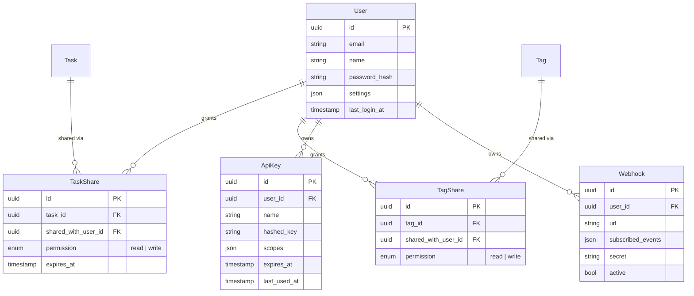
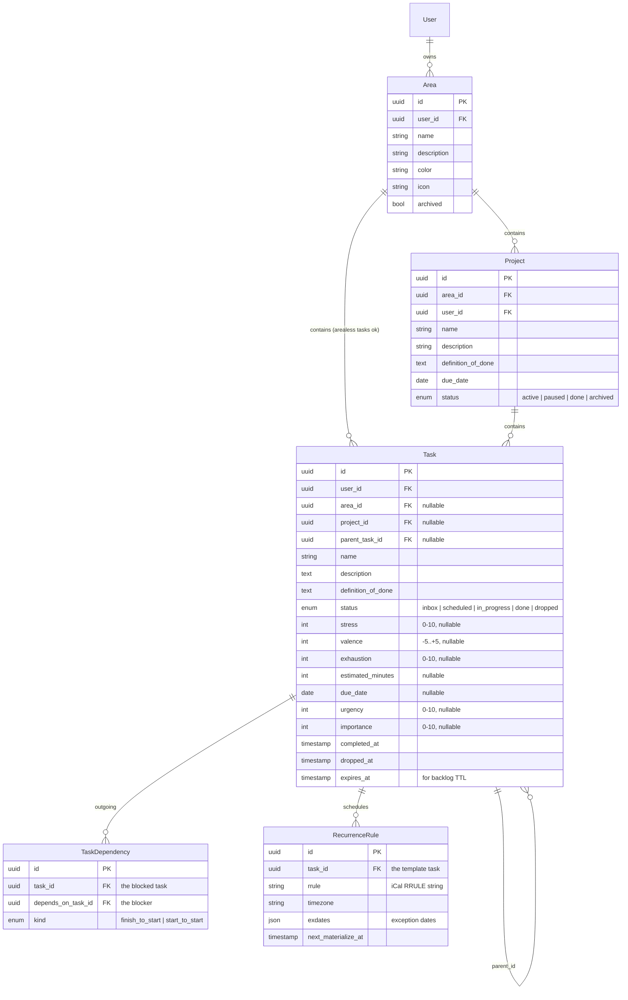
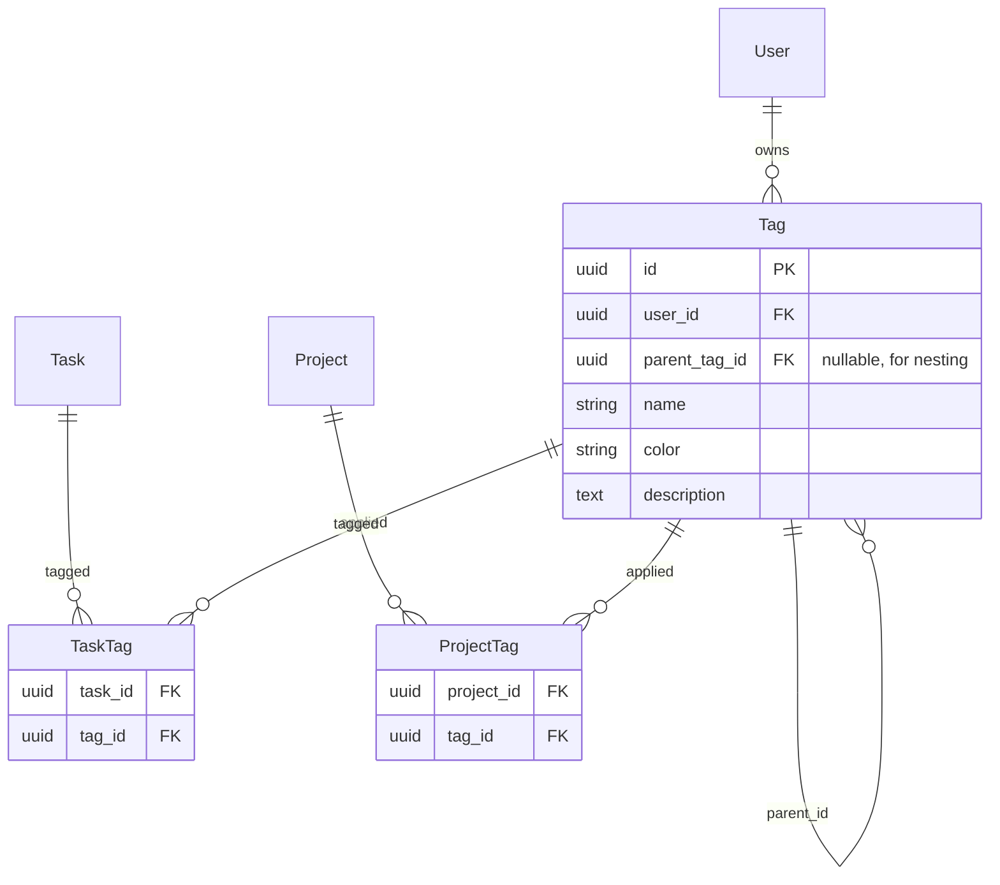
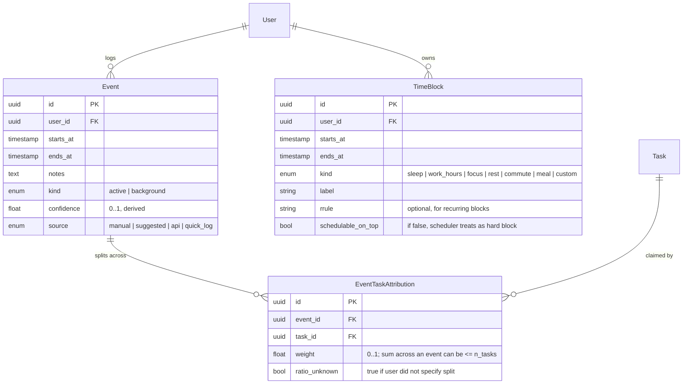
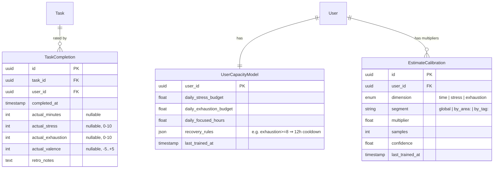
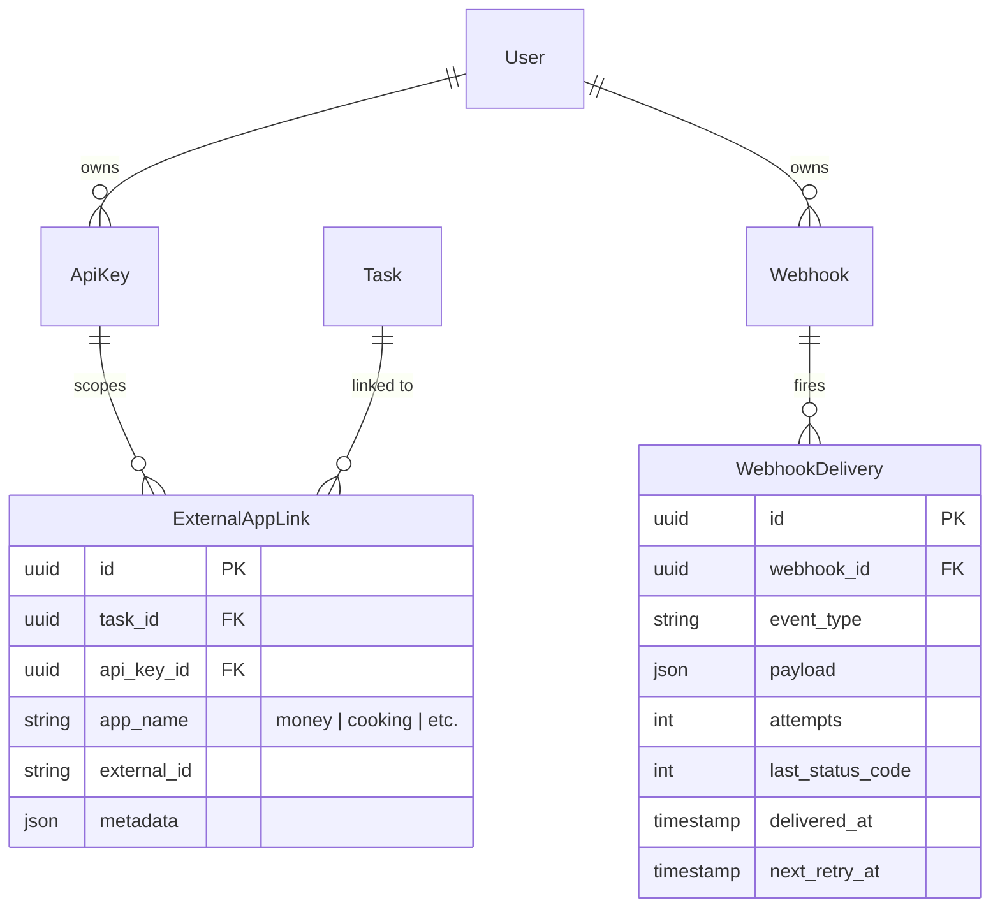

# Task App — Design Document

**Status:** Draft
**Last updated:** 2026-05-15
**Position in ecosystem:** Personal-planning hub. Owns the canonical schedule and task graph; exposes a verbose API so the Money App, Cooking App, and future apps can read schedule data and request time slots.

---

## 1. Executive Summary

The Task App is a personal planning system that lets the user **see, plan, and learn from how their effort is distributed over time**. Unlike a to-do list or a calendar, it tracks tasks across multiple dimensions — due date, urgency, importance, time, stress, valence, and exhaustion — and uses observed completions to learn the user's true daily capacity. The output is a visual day/week schedule that the user can either accept as recommended or override.

### Key deliverables

1. **Task graph** — Areas → Projects → Tasks with subtask nesting, dependencies, and recurrence (RRULE).
2. **Multi-dimensional metric model** — every task carries stress, valence, time estimate, urgency, importance, exhaustion, and a due date; daily capacity budgets cap how much of each can be scheduled.
3. **Visual scheduler** — Google-Calendar-style day/week grid where tasks become events. Supports parallel events, background events (sleep/work-hours/commute), and "lazy" wide-window logging.
4. **Recommendation engine** — given the backlog, capacity, dependencies, and recovery rules, produces a suggested plan the user can reshuffle.
5. **Calibration loop** — a lightweight ML layer adjusts per-user multipliers on stress / time / exhaustion estimates from observed completion data, and refines daily capacity budgets over time.
6. **Quick capture** — keyboard, mobile widget (future), text-message-in (future), API (day-one).
7. **Backlog + Someday/Bucketlist** — durable holding pen with optional expiration.
8. **External API** — REST + webhook surface so other apps in the ecosystem can read schedule, request slots, and subscribe to events.
9. **Sharing** — selected tasks and tags can be shared with other users (read or collaborate).

---

## 2. Background & Problem Statement

Existing planning tools force a choice:

- **Calendar apps** (Google Calendar, Apple Calendar) handle time blocks well but treat every event identically — a 30-minute dentist appointment and a 30-minute deep-work block look the same and cost the same in your head, but they don't.
- **Task managers** (Things, Todoist, Linear) handle the task graph well but have no native concept of "where does this fit in my day, and do I have the energy for it?"
- **Time-block planners** (Sunsama, Motion) get closer but optimize for paid work and don't model recovery cost, hobbies, or constant chores.

What the user actually wants to see: *"This week I have 18 hours of planned work, 7 of which are high-stress, and Tuesday is already overcommitted on exhaustion."* No tool surfaces that today.

The second gap is **the ecosystem play**. The user is building a constellation of personal apps (Money App, Cooking App, etc.) that need to coordinate on time. None of the off-the-shelf tools expose a verbose-enough API for "Cooking App wants 45 minutes Thursday evening, and needs the slot to be low-stress because we already have a hard meeting earlier that day."

The third gap is **self-knowledge**. The user wants to learn — across months — how much they can actually sustain, where they over- or under-estimate, and what mix of work leaves them depleted vs. energized. That requires recording completions against estimates and feeding it back into the planner.

---

## 3. Actors & Roles

| Actor | Role | Auth context |
|-------|------|--------------|
| **Primary user (Planner)** | Owns all their own tasks, areas, projects, tags, schedule, capacity budgets, and API keys. | Logged-in account holder. |
| **Collaborator** | Another user with whom the Planner has shared a task, project, or tag. May have read or read-write permission. | Logged-in account holder with sharing grants. |
| **API consumer** | Another app in the ecosystem (Money App, Cooking App) acting on behalf of the user via an API key. Scoped permissions. | Bearer token / API key. |
| **Notification service** | Internal worker that fires push notifications and webhooks. | Internal service identity. |
| **Scheduler service** | Internal worker that runs the recommendation engine and the calibration ML loop. | Internal service identity. |

There is **no admin role** for v1 — this is a personal product.

---

## 4. User Stories

### 4.1 Primary user (Planner)

**Capture**
- As a Planner, I want to drop a task into my backlog in under 3 seconds (keyboard shortcut, mobile widget, text-in, API) so I never lose a thought.
- As a Planner, I want to capture a task with only a name, and fill in metrics later.

**Visualize**
- As a Planner, I want to open the app and immediately see today's plan as a calendar grid.
- As a Planner, I want a week view that shows planned stress and exhaustion totals per day so I can spot overcommits.
- As a Planner, I want background-time blocks (sleep, work hours, commute) to render in lighter color so I can tell them apart from active tasks.
- As a Planner, I want to see two events overlap on the grid when I claimed I did two things at once.

**Plan**
- As a Planner, I want to tag tasks (school, research, work, hobby, chores, Seymour, pets) — and have tags nest, so "Seymour" is under "Pets" under "Chores".
- As a Planner, I want to set due dates, urgency, importance, time estimate, stress, valence, and exhaustion on a task — but only the ones I care about for that task.
- As a Planner, I want to mark dependencies ("file taxes" must come before "apply for graduation").
- As a Planner, I want to mark tasks as recurring with RRULE-style rules (every Tuesday, every weekday morning, last day of the month).
- As a Planner, I want to drag a backlog item onto the calendar to schedule it.
- As a Planner, I want the app to *suggest* a plan that respects my daily stress / exhaustion budget, my dependencies, and my recovery needs after high-exhaustion tasks.
- As a Planner, I want to reshuffle the suggested plan freely; my edits beat the algorithm.

**Track and log**
- As a Planner, I want to log "I did this 4–8pm" on a single task, *or* claim two tasks for the same 4–8pm window if I multitasked. The app should record both, lower its confidence, and not double-count my time.
- As a Planner, when I'm lazy, I want to drag a task across the whole day and have the app record it as "happened sometime today" without assuming the full window cost me 12 hours.
- As a Planner, I want to mark a task done, optionally rate how stressful and exhausting it actually was, and have the app use that to calibrate future estimates.
- As a Planner, I want to be alerted as a task's due date approaches, especially for things buried in the backlog.

**Reflect**
- As a Planner, I want a metrics view that shows how I spent my time over the past week / month, broken out by tag, area, and project.
- As a Planner, I want to see whether my self-reported stress / exhaustion budget is trending up or down.
- As a Planner, I want to see where my estimates were systematically off (e.g., "you underestimate research tasks by 1.6x").

**Backlog & wishlist**
- As a Planner, I want a Someday / Bucketlist area for things I want to do eventually with no due date.
- As a Planner, I want backlog items to be able to expire ("if you haven't picked this up in 90 days, archive it").

**Share**
- As a Planner, I want to share a tag (e.g., "Italy trip") so a co-planner can see and add tasks under that tag.
- As a Planner, I want to share a single task ("pick up the package Friday") with someone without giving them access to anything else.
- As a Planner, I want to revoke sharing at any time.

### 4.2 Collaborator

- As a Collaborator, I want to see the tasks and tags shared with me, segregated from my own data.
- As a Collaborator with read-write permission, I want to add tasks, edit metrics, and mark done.
- As a Collaborator, I want my changes to show up on the Planner's app in near real time.

### 4.3 API consumer (other apps in the ecosystem)

- As an API consumer, I want to query free time windows that match constraints (length, allowed stress level, time of day).
- As an API consumer, I want to create a task on the user's behalf and request it be scheduled in a specific window or "anytime this week."
- As an API consumer, I want to subscribe to a webhook so I get notified when a task I created is rescheduled, completed, or missed.
- As an API consumer, I want to be told *why* a slot request was denied (insufficient stress budget, conflicting block, missing dependency).
- As an API consumer, I want my API key scoped to specific actions (read schedule only, vs. create tasks, vs. modify budgets).

---

## 5. Feature List

### 5.1 Required (v1)

| Feature | Notes |
|---|---|
| Area / Project / Task hierarchy | Areas ongoing, Projects bounded, Tasks atomic with optional subtask nesting via `parent_id`. |
| Per-task metrics | Stress, valence, time estimate, due date, urgency, importance, exhaustion. All optional. |
| Hierarchical tags | Many-to-many with tasks; tags can have a parent tag. |
| Calendar grid (day & week) | Drag-and-drop, click-to-create, resize. |
| Background events | Sleep, work hours, commute — render lighter, schedulable on top. |
| Parallel events | Two events can overlap; system records both with reduced confidence. |
| "Lazy log" | Drag a task across an arbitrary window without claiming full-window cost. |
| Backlog / Inbox | Default landing zone for quick-capture; items can be scheduled later. |
| Quick capture (keyboard + API) | API-first so other apps and shortcuts can hit it; mobile/text later. |
| Recommendation engine | Suggests an ordered plan honoring deps, budgets, due dates, recovery. User edits win. |
| Task dependencies | Hard ordering, surfaced as scheduler constraints. |
| Recurring tasks | RRULE format. |
| Daily capacity budgets | Max stress, max focused hours, max exhaustion per day. Editable. |
| Energy recovery rule | High-exhaustion tasks block scheduling for N hours / cost recovery from next day. |
| Completion logging | Mark done, optional retrospective rating of actual stress / exhaustion / time. |
| Calibration ML | Per-user multipliers + capacity refinement from completion history. |
| Metrics view | Time breakdown by tag / area / project. Capacity trend lines. Estimate accuracy. |
| Sharing | Per-task and per-tag sharing with read or read-write permission. |
| External REST API | Full CRUD + slot-query + webhook subscription. OpenAPI spec. |
| Webhooks | Out-bound events: task created, scheduled, rescheduled, completed, missed. |
| Auth | Email/password + OAuth at minimum. Multi-user. |
| Notifications | In-app first; push later. Approaching-due-date alerts. |

### 5.2 Planned (post-v1)

| Feature | Notes |
|---|---|
| Mobile app + home-screen widget | React Native / Expo. Widget shows today + quick capture. |
| Text-message capture | Twilio or similar — text a number, lands in inbox. |
| Push notifications | Web Push + Expo Push for mobile. |
| Someday / Bucketlist | Long-term wishlist, no due date, optional auto-archive. |
| Backlog expiration | Configurable per-tag or per-area TTL with archive workflow. |
| Templates | Named day templates ("research day", "errands day") that pre-fill a schedule. |
| Smarter overlap attribution | Ask the user "you said you did A and B from 4–8pm — roughly which got more time?" |
| Cross-app slot negotiation | Cooking App / Money App request slots, Task App proposes options, requester confirms. |

### 5.3 Optional / future

| Feature | Notes |
|---|---|
| Read-only calendar publish | iCal feed for external calendars. |
| Voice capture | "Hey, add 'call mom' to my backlog." |
| Team / family mode | Shared household calendars, chore rotation. |
| Wearable integration | Pull heart-rate / sleep data to refine exhaustion model. |
| Natural-language input | "Schedule a 90-min focus block Tuesday afternoon." |
| Insights digest | Weekly email summarizing time / stress / completion patterns. |
| Public read-only profile | "Here's what I'm working on this week," shareable link. |

---

## 6. Technical Architecture

### 6.1 Tech stack

**Frontend (web)**
- Next.js 16 (App Router) + TypeScript strict
- Tailwind CSS + shadcn/ui
- Zustand for client state
- Calendar UI: FullCalendar or React Big Calendar (decision in build phase)
- Forms: react-hook-form + Zod

**Backend**
- Next.js Route Handlers for the public REST API + OpenAPI generation
- tRPC for internal app-to-server calls
- Prisma + PostgreSQL
- BullMQ + Redis for scheduled jobs (notifications, recurrence materialization, ML jobs)
- Auth: NextAuth (email/password + OAuth) — choice subject to multi-device session needs

**Calibration / ML**
- Lightweight: per-user linear multipliers fit nightly with a BullMQ job. No model server needed for v1.
- Stored in Postgres as `EstimateCalibration` rows.

**Mobile (future)**
- React Native + Expo, sharing Zod schemas and tRPC client with web.

**External API**
- REST under `/api/v1/*`, bearer-token auth via `ApiKey`.
- OpenAPI 3.1 spec generated from Zod schemas (e.g., `zod-to-openapi`).
- Webhooks signed with per-subscription HMAC secret.

### 6.2 Infrastructure

- **Hosting:** containerized; same Docker Compose pattern as the rest of the ecosystem (Postgres + Redis + Next.js + worker).
- **Database:** PostgreSQL 15+. Single primary in v1.
- **Queue / cache:** Redis 7+.
- **Workers:** dedicated Node process running BullMQ consumers for `recurrence-materializer`, `notification-dispatch`, `ml-calibration`, `webhook-delivery`.
- **Storage:** Postgres only for v1 (no file uploads).
- **Observability:** structured logs to stdout; metrics endpoint for Prometheus-style scraping; error tracking via Sentry (or equivalent).
- **Secrets:** environment variables, `.env.local` for dev.
- **Ecosystem visibility:** the app registers itself as a County in the Ecosystem Builder, with Frontend / Backend / Worker / Database cities.

---

## 7. Database Schema (EERD)

Schema is split into six domains. All tables have `id` (uuid), `created_at`, `updated_at` unless noted.

### 7.1 Users & Sharing

### 7.2 Task hierarchy

**Hierarchy decision:** I chose **Area → Project → Task** (Things 3 / GTD model), with optional subtask nesting via `parent_task_id`. Rationale: it matches the user's mental model ("Seymour is sick" = Project under Pets Area, "give Seymour his meds at 6pm" = Task under that Project). It also cleanly separates *ongoing responsibilities* (Areas, never done) from *bounded efforts* (Projects, have a goal). Subtasks via `parent_task_id` cover the "small piece I didn't finish" case mentioned in the original notes.

**Recurrence model:** the recurring task is a template. A nightly `recurrence-materializer` worker reads `RecurrenceRule.next_materialize_at` and creates concrete `Task` rows for the next horizon (e.g., 14 days out), each carrying a `template_task_id` (a self-reference on `Task` — added as a nullable column).

### 7.3 Tags

Tags are **orthogonal** to the Area/Project structure — used for context labels ("morning", "computer", "errand", "low-energy") and cross-cutting categorization. They nest via `parent_tag_id`, so "Seymour" can sit under "Cats" under "Pets" and querying "Pets" returns matches on any descendant.

### 7.4 Scheduling & time tracking

**Why split Event from EventTaskAttribution?** It lets one Event represent a single time window the user claims they were working, while attributing that window to one or more tasks. Single-task event: one attribution at weight=1.0. Two parallel tasks: two attributions at weight=1.0 each with `ratio_unknown=true` (the system records both happened in the window but does not double-count toward time-spent metrics until calibration resolves the split). The "drag across the whole day" lazy-log case: an Event with a wide window, low `confidence`, and one attribution — the system will discount its contribution to time-spent estimates.

**TimeBlock vs Event:** TimeBlocks are the user's stable structure (when they sleep, when they work). Events are claims that *work happened* — TimeBlocks shape the scheduler's allowed regions.

### 7.5 Calibration

`UserCapacityModel` starts with sensible defaults the user can edit. A nightly `ml-calibration` worker reads recent `TaskCompletion` rows and updates `EstimateCalibration` multipliers (segmented globally, by area, and by tag). The scheduler reads both when ordering tasks.

### 7.6 API & Integrations

`ApiKey` and `Webhook` live in the Users & Sharing domain — repeated here only to show the integration relationships. `ExternalAppLink` lets other apps anchor "this Task corresponds to *my* recipe #12 / *my* expense #87" without polluting the Task table.

---

## 8. Pages & Features

| # | Page | Purpose | Key features |
|---|------|---------|--------------|
| 1 | **Today** | Default landing page. Single-day calendar grid. | Drag-and-drop from inbox; quick-add with keyboard; live stress / exhaustion meter; "next up" card; mark-done inline. |
| 2 | **Week** | 7-day grid. | Per-day stress / exhaustion totals at column tops; drag tasks across days; collapse background blocks; week-summary footer. |
| 3 | **Backlog / Inbox** | Quick-capture landing + unscheduled tasks. | Bulk-tag; bulk-set metrics; drag-to-schedule; filter by missing-metric (e.g. "no due date"). |
| 4 | **Areas** | Dashboard of life areas. | Per-area progress, project count, time-spent-last-30-days, archived toggle. |
| 5 | **Projects** | List + detail. | Definition of done; due date; task list with status; progress bar; archive when done. |
| 6 | **Project detail** | One project. | Embedded task list with subtasks; dependency graph; cumulative time-spent vs estimate. |
| 7 | **All Tasks** | Flat filterable list. | Filter by status, tag, area, project, due-date range, missing-metric; saved filters; bulk edit. |
| 8 | **Tags** | Manage tag tree. | Drag-to-reparent; share tag; tag color / icon; usage counts. |
| 9 | **Recurring** | Manage recurrence templates. | RRULE editor (UI surface for common patterns + raw RRULE for power users); preview next 14 occurrences; pause / resume. |
| 10 | **Someday / Bucketlist** | Things to do eventually. | Optional auto-archive; promote-to-task; tag and area assignment. |
| 11 | **Metrics** | Insights view. | Stacked-area chart of time by tag/area/project over selectable range; estimate-accuracy report; capacity trend lines; completion-rate heatmap. |
| 12 | **Dependencies** | Graph view (optional in v1, planned). | Visual dependency graph for a project or filtered set. |
| 13 | **Shared with me** | Inbound shares. | Tasks and tags shared by other users; segregated from own data; permission badge. |
| 14 | **Settings — Profile** | Account basics. | Name, email, password, OAuth links. |
| 15 | **Settings — Capacity** | Edit budgets and recovery rules. | Daily stress / exhaustion / focused-hours budgets; recovery rules ("if exhaustion ≥ 8, block scheduling for 12h"). |
| 16 | **Settings — Time blocks** | Manage stable schedule. | Sleep window, work hours, recurring meals, commute; RRULE-backed. |
| 17 | **Settings — Notifications** | Preferences. | Channels (in-app v1, push later); lead times; quiet hours. |
| 18 | **Settings — Sharing** | Manage outbound shares. | List of shared tasks/tags; revoke; pending invites. |
| 19 | **Settings — API** | Integrations. | Create / revoke API keys; scope picker; usage stats; webhook subscriptions with test-fire button; OpenAPI spec link. |

---

## 12. Scope Summary

**In scope for v1:**
- Web app (desktop-first, responsive).
- Full task graph: Areas, Projects, Tasks, subtasks, dependencies, recurrence (RRULE).
- Multi-dimensional metrics with daily capacity budgets and recovery rules.
- Calendar grid (day + week) with foreground and background events, parallel events, lazy logging.
- Recommendation engine respecting deps, budgets, recovery, due dates.
- Completion logging + nightly ML calibration of estimates and capacity.
- Hierarchical tags, orthogonal to Areas / Projects.
- Backlog / Inbox with quick capture (keyboard + API on day one).
- Someday / Bucketlist with optional expiration.
- Sharing — per-task and per-tag, read or read-write.
- External REST API + webhooks + OpenAPI spec.
- In-app notifications for approaching due dates.
- Auth (email/password + OAuth), multi-user.

**Deferred (planned, post-v1):**
- Mobile app + home-screen widget (React Native / Expo).
- Push notifications.
- Text-message capture.
- Templates (named day templates).
- Smarter overlap attribution (active prompt for ratio).
- Cross-app slot negotiation flow (request → propose → confirm).

**Out of scope:**
- Calendar sync (Google / Apple / iCal) — pull or push.
- Team / family / household mode.
- Wearable / biometric integration.
- Voice input.
- Public-facing read-only schedule.

---

## 13. Risks & Considerations

| Risk | Impact | Mitigation |
|---|---|---|
| **Capture friction kills adoption.** Most planning apps die because adding a task takes too long. | High — without trustworthy capture, the rest of the system is starved. | Keyboard-first design; API available on day one; mobile widget and text-in are the highest-priority post-v1 items. |
| **The recommendation engine becomes annoying.** If it constantly suggests things the user immediately overrides, trust collapses. | High — user stops looking at suggestions. | Suggestions are advisory and explainable ("scheduled here because A blocks B and stress budget is full Tuesday"). User edits always win and the engine learns from them, not just from completions. |
| **Calibration ML overfits or oscillates.** With sparse data, multipliers can swing wildly. | Medium — user loses trust in estimates. | Bayesian-style update with priors; multipliers clamped to a sane range; surface confidence alongside the multiplier; let user reset segments. |
| **Parallel-event attribution math is ambiguous.** "I did A and B from 4–8pm" — how much time goes to each? | Medium — affects per-task time tracking and ML feedback. | Record both with `ratio_unknown=true`; do not contribute to time-spent until ratio is resolved by user or aggregated stats. Surface "ambiguous time" as its own metric so the user can see how much of their log is uncertain. |
| **RRULE complexity in the UI.** Power users want raw RRULE; everyone else wants "every Tuesday." | Medium — confusing or limited. | Build a tiered editor: common-pattern picker for 95% of cases, raw RRULE field exposed for the rest. |
| **Dependency cycles.** Users will create A→B→A. | Low–medium — graph corruption, scheduler infinite loops. | Validate at write time with a cycle check; surface a clear error pointing at the cycle. |
| **Sharing leakage.** Cross-user data exposure via tag or task share. | High — privacy bug. | Every query funnels through a permission helper; integration tests cover share / revoke flows; never join across users without an explicit share row. |
| **Scheduler performance.** Recommendation over a large backlog with many constraints can blow up. | Medium — slow UX. | Recommendation runs as a queued job for large recomputes; incremental re-plan on small edits; cap the planning horizon (default 14 days). |
| **Webhook reliability.** Other apps in the ecosystem depend on delivery. | Medium — silent breakage of dependent apps. | Persisted `WebhookDelivery` rows with exponential-backoff retry; signed payloads; admin view to inspect failures. |
| **Notification spam.** Aggressive alerting causes the user to mute the app. | Medium — defeats the whole "alert me before things rot" goal. | Conservative defaults; per-tag and per-area mute; daily digest mode as an alternative to per-event pings. |
| **Self-knowledge feedback loop is uncomfortable.** "You consistently overcommit on Wednesdays" can feel like nagging. | Low – medium — affects user attachment to the app. | Frame insights neutrally and on-demand; user can hide metric panels they don't want to see. |
| **Single-user blast radius.** Personal data, single Postgres primary. | Medium — data loss. | Nightly Postgres backups; export-to-JSON path; standard restore drill documented before launch. |
| **API scope creep from other apps.** Money App / Cooking App keep needing new endpoints. | Medium — API churn. | Treat the API as a first-class deliverable with versioning (`/api/v1`); breaking changes get a new major version, not a mutation of the existing one. |
